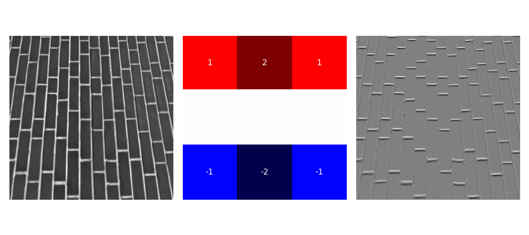
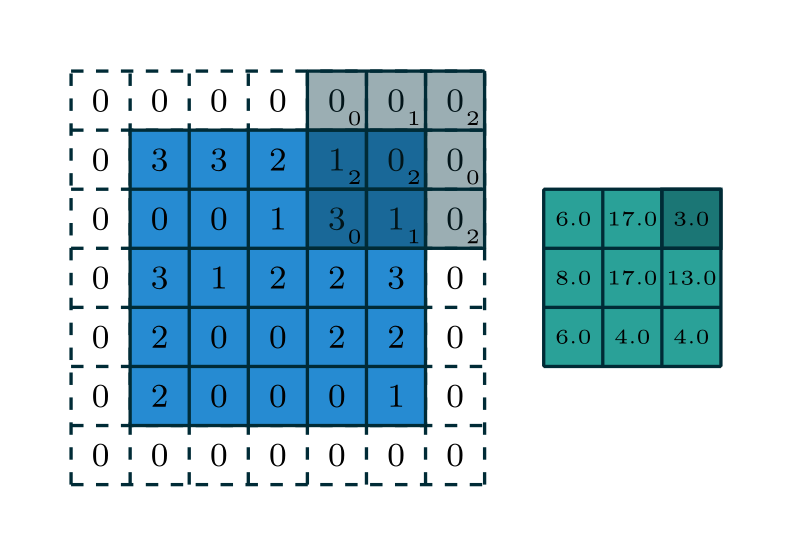

# Working with Images

---

# (Grayscale) Images are Matrices


---

# (Color) Images are Tensors


---

# PyTorch: `torchvision.transform`s (V1)

```python {1,3,12|5|8-11}
from torchvision import transforms

transform = transforms.Compose([
    # Convert PIL image to tensor (and scale values)
    transforms.ToTensor(), # Deprecated in V2
    # Apply other transforms
    # Apply normalization
    transforms.Normalize(
      mean=[0.485, 0.456, 0.406], 
      std=[0.229, 0.224, 0.225]
    ),
])
```

`ToTensor` is <span v-mark.circle.orange>deprecated in V2</span>.

---

# PyTorch: `torchvision.transform.v2`s (V2)

```python {1,3,13|5|8|10-12}
import torchvision.transforms.v2 as transforms

transform = transforms.Compose([
    # Convert PIL image to tensor
    transforms.ToImage(),
    # Apply other transforms
    # Convert to float32 tensor (scale to range [0,1])
    transforms.ToDtype(torch.float32, scale=True),
    # Apply normalization
    transforms.Normalize(
      mean=[0.485, 0.456, 0.406],
      std=[0.229, 0.224, 0.225])
])
```

---

# Convolutional Filters: Edge Detection



---

# Convolution Operation

$$
	\begin{pmatrix} i_{11} & i_{12} \\ i_{21} & i_{22}\end{pmatrix} \star \begin{pmatrix} w_{11} & w_{12} \\ w_{21} & w_{22}\end{pmatrix} 
	= i_{11}w_{11} + i_{12}w_{12} + i_{21}w_{21} + i_{22}w_{22}
$$

<v-clicks>

* Element-wise multiplication
* Summation

</v-clicks>

---
transition: none
--- 

# Convolution Operation: Visual Representation

<div grid="~ cols-2 gap-4 place-items-center h-full">
<div class>


</div>
<div class>


</div>
</div>

<div class="text-xs text-center mt-8">
Dumoulin, Vincent, and Francesco Visin. "A guide to convolution arithmetic for deep learning." arXiv preprint arXiv:1603.07285 (2016).
</div>

---
transition: none
--- 

# Convolution Operation: Visual Representation

<div grid="~ cols-2 gap-4 place-items-center h-full">
<div class>


</div>
<div class>


</div>
</div>

<div class="text-xs text-center mt-8">
Dumoulin, Vincent, and Francesco Visin. "A guide to convolution arithmetic for deep learning." arXiv preprint arXiv:1603.07285 (2016).
</div>

---
transition: none
--- 

# Convolution Operation: Visual Representation

<div grid="~ cols-2 gap-4 place-items-center h-full">
<div class>



</div>
<div class>


</div>
</div>

<div class="text-xs text-center mt-8">
Dumoulin, Vincent, and Francesco Visin. "A guide to convolution arithmetic for deep learning." arXiv preprint arXiv:1603.07285 (2016).
</div>

--- 

# Convolution Operation: Visual Representation

<div grid="~ cols-2 gap-4 place-items-center h-full">
<div class>


</div>
<div class>


</div>
</div>

<div class="text-xs text-center mt-8">
Dumoulin, Vincent, and Francesco Visin. "A guide to convolution arithmetic for deep learning." arXiv preprint arXiv:1603.07285 (2016).
</div>

--- 

# PyTorch: 2D Convolution

$$
O(N_i, C_{O_j}) = b(C_{O_j}) + \sum_{k=0}^{C_I - 1} W(C_{O_j}, k) \star I(N_i, k) 
$$

```python {1-8|2|3|4|5|6,7|0-8}
torch.nn.Conv2d(
  in_channels, 
  out_channels, 
  kernel_size, 
  stride=1, padding=0, dilation=1, 
  bias=True,
  padding_mode='zeros'
)
```

`padding="same"` automatically adds padding to keep the output size the same as the input size.

---
layout: section
---

# Working with Text

---

# TODO

@Rafael

---
