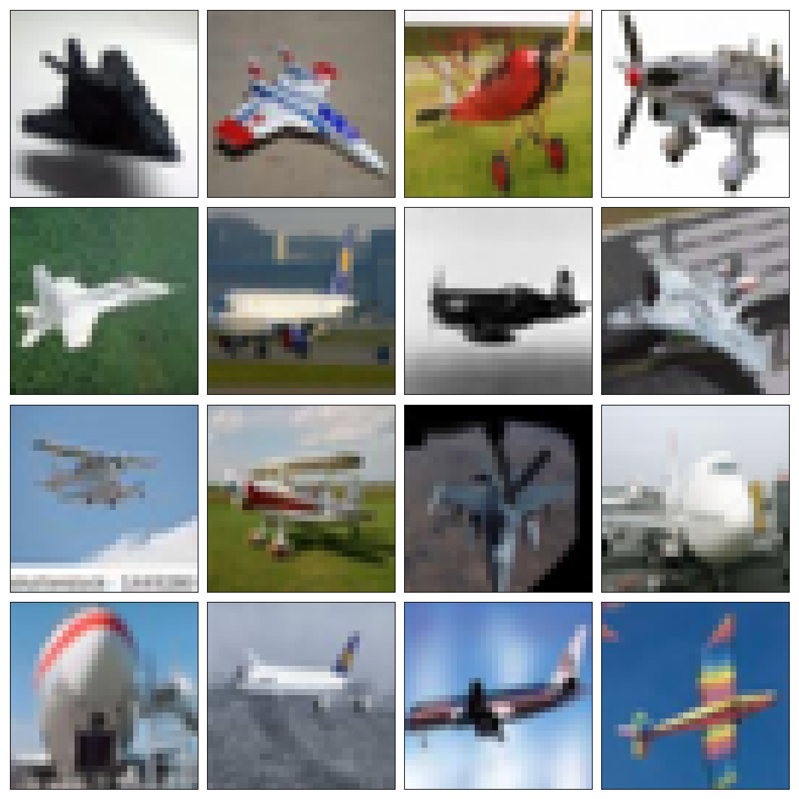
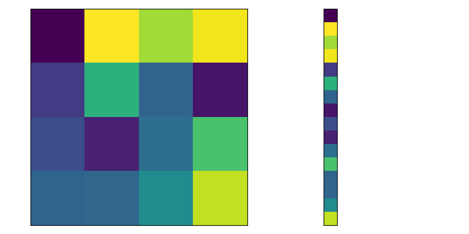

# Convolutional Neural Networks (CNNs)

---

# Computer Vision

> Computer vision is an interdisciplinary field that deals with
> how computers can be made to gain high-level understanding from digital images or videos.
> From the perspective of engineering, it seeks to automate tasks that the human visual system can do.

<v-clicks>

* Image classification
* Object detection
* Self-driving cars/autonomous vehicles
* Medicine and healthcare
* Generative art
* ...

</v-clicks>

---

# Challenges in Computer Vision

<v-clicks>

* Variability in appearance (lighting, angle, occlusion)
* Different object scales and orientations
* Background clutter
* Limited labeled data
* ...

</v-clicks>

---

# Fully Connected Neural Networks: How Many Parameters?

* Input: $100 \times 100$ pixel (grayscale image)
* First hidden layer: $1000$ neurons

How many parameters (connections) are there between the input and fist hidden layer?

$100 \times 100 \times 1000 = 10,000,000$ parameters!

---

# Fully Connected Neural Networks: How Many Parameters?

<v-clicks>

* Too many parameters
* Loss of spatial information

</v-clicks> 

How can *spatial information* be *preserved* and *exploited*?

We need Convolutional Neural Networks (CNNs)!

---

# 2D Convolutions

<v-clicks>

* Linear operation
* Weights shared across pixels 
  * Reduces number of parameters
* An output pixel depends on neighboring input pixels 
  * Retains spatial information

</v-clicks>

---

# Convolutional Neural Networks: How Many Parameters?

* Input: $100 \times 100$ pixel, 3 color channels
* Convolutional kernel: $5 \times 5$
* Bias: true
* Output: $200$ feature maps ($100 \timex 100$ pixels each)

How many parameters (connections) are there for the first layer?

$(5 \times 5 \times 3 + 1) \times 200 = 15,200$ parameters!

---

# CNN Ingredients

---
