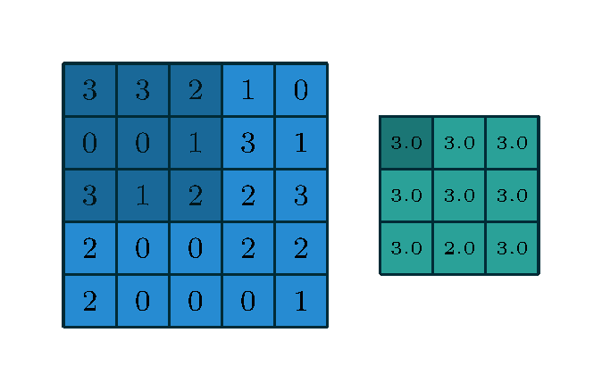
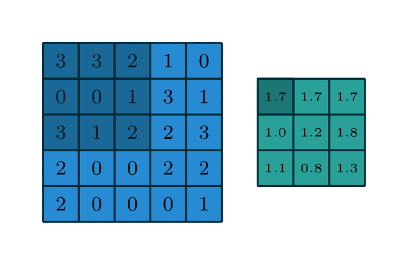
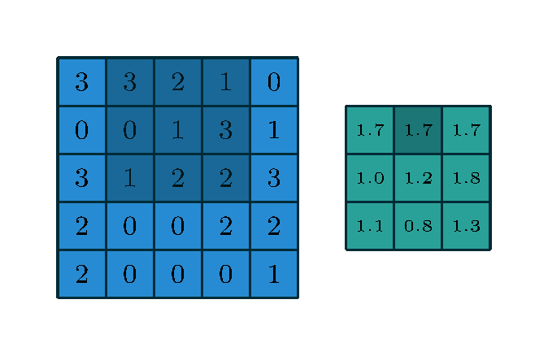
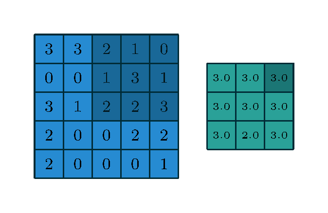
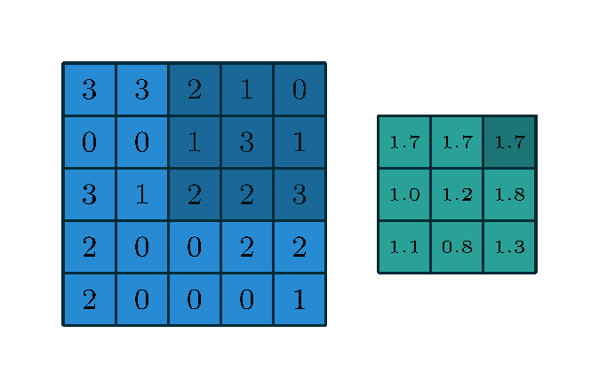
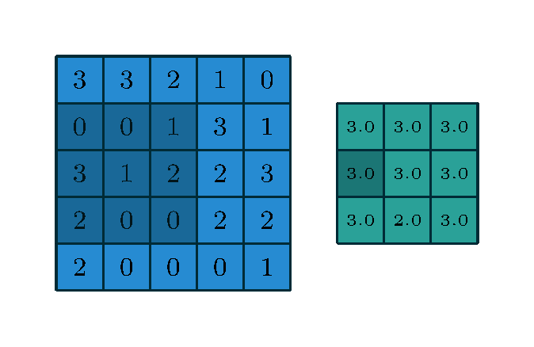
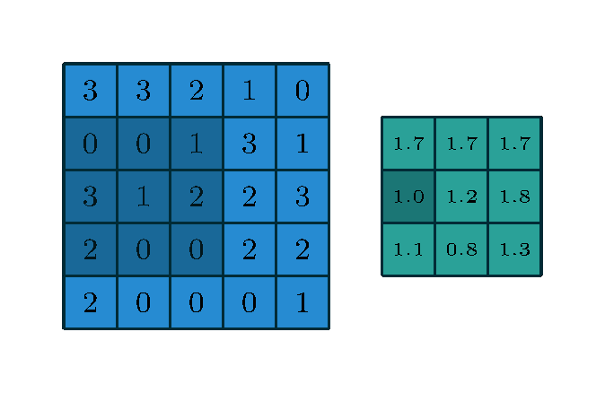

# Convolutional Neural Networks (CNNs)

---

# Computer Vision

> Computer vision is an interdisciplinary field that deals with
> how computers can be made to gain high-level understanding from digital images or videos.
> From the perspective of engineering, it seeks to automate tasks that the human visual system can do.

<v-clicks>

* Image classification
* Object detection
* Self-driving cars/autonomous vehicles
* Medicine and healthcare
* Generative art
* ...

</v-clicks>

---

# Challenges in Computer Vision

<div grid="~ cols-2 gap-4">
<div>


</div>
<div>

<v-clicks>

* Variability in appearance (lighting, angle, occlusion)
* Different object scales and orientations
* Background clutter
* Limited labeled data
* ...

</v-clicks>

</div>
</div>

---

# Fully Connected Neural Networks: How Many Parameters?

* Input: $100 \times 100$ pixel (grayscale image)
* First hidden layer: $1000$ neurons

How many parameters (connections) are there between the input and fist hidden layer?

$100 \times 100 \times 1000 = 10,000,000$ parameters!

---

# Fully Connected Neural Networks: How Many Parameters?

<div grid="~ cols-2 gap-4">
<div>


</div>
<div>

<v-clicks>

* Too many parameters
* Loss of spatial information

</v-clicks> 

How can *spatial information* be *preserved* and *exploited*?

We need Convolutional Neural Networks (CNNs)!

</div>
</div>

---

# 2D Convolutions

<v-clicks>

* Linear operation
* Weights shared across pixels 
  * Reduces number of parameters
* An output pixel depends on neighboring input pixels 
  * Retains spatial information

</v-clicks>

---

# Convolutional Neural Networks: How Many Parameters?

* Input: $100 \times 100$ pixel, 3 color channels
* Convolutional kernel: $5 \times 5$
* Bias: true
* Output: $200$ feature maps ($100 \timex 100$ pixels each)

How many parameters (connections) are there for the first layer?

$(5 \times 5 \times 3 + 1) \times 200 = 15,200$ parameters!

---

# CNN Ingredients

<div grid="~ cols-2 gap-4">
<div>


</div>
<div>

<v-clicks>

* Convolutional layers
* Pooling layers
* Activation functions
* Normalization layers
  * Batch normalization
  * Local response normalization
* Fully connected layers

</v-clicks> 

</div>
</div>

--- 

# PyTorch: 2D Convolution

$$
O(N_i, C_{O_j}) = b(C_{O_j}) + \sum_{k=0}^{C_I - 1} W(C_{O_j}, k) \star I(N_i, k) 
$$

```python {1-8|2|3|4|5|6,7|0-8}
torch.nn.Conv2d(
  in_channels, 
  out_channels, 
  kernel_size, 
  stride=1, padding=0, dilation=1, 
  bias=True,
  padding_mode='zeros'
)
```

`padding="same"` automatically adds padding to keep the output size the same as the input size.

--- 

# PyTorch: Pooling

<div grid="~ cols-2 gap-4">
<div>

## Max Pooling

```python
torch.nn.MaxPool2d(
  kernel_size, stride=None, 
  padding=0, dilation=1
)
```



</div>
<div>

## Average Pooling


```python
torch.nn.AvgPool2d(
  kernel_size, stride=None, 
  padding=0
)
```



</div>
</div>

---

# PyTorch: Pooling

<div grid="~ cols-2 gap-4">
<div>

## Max Pooling

```python
torch.nn.MaxPool2d(
  kernel_size, stride=None, 
  padding=0, dilation=1
)
```


</div>
<div>

## Average Pooling


```python
torch.nn.AvgPool2d(
  kernel_size, stride=None, 
  padding=0
)
```



</div>
</div>

---

# PyTorch: Pooling

<div grid="~ cols-2 gap-4">
<div>

## Max Pooling

```python
torch.nn.MaxPool2d(
  kernel_size, stride=None, 
  padding=0, dilation=1
)
```



</div>
<div>

## Average Pooling


```python
torch.nn.AvgPool2d(
  kernel_size, stride=None, 
  padding=0
)
```



</div>
</div>

---

# PyTorch: Pooling

<div grid="~ cols-2 gap-4">
<div>

## Max Pooling

```python
torch.nn.MaxPool2d(
  kernel_size, stride=None, 
  padding=0, dilation=1
)
```



</div>
<div>

## Average Pooling


```python
torch.nn.AvgPool2d(
  kernel_size, stride=None, 
  padding=0
)
```



</div>
</div>

---

# PyTorch: ReLU activation function

ReLU (Rectified Linear Unit) is a popular activation function in CNNs.

<div grid="~ cols-2 gap-4">
<div>


</div>
<div>


```python
torch.nn.ReLU(inplace=False)
```

Functional API:
```python
torch.nn.functional.relu(
  input, 
  inplace=False
)
```

</div>
</div>

---

# Simple CNN in PyTorch

```python {1,10|2|3|4|5|6|7|8|9|1-10}
nn.Sequential([
  nn.Conv2D(3, 16, 3),
  nn.MaxPool2d(2),
  nn.ReLU(),
  nn.Conv2D(16, 32, 3),
  nn.MaxPool2d(2),
  nn.ReLU(),
  nn.Flatten(),
  nn.Linear(256, 10)
])
```

---

# PyTorch: `nn.Flatten` and `view`

`nn.Flatten()` is useful in conjunction with `nn.Sqeuential`.
`torch.Tensor.view()` is more general (and used directly in `forward()`).


<div grid="~ cols-2 gap-4">
<div>

### `nn.Flatten`

```python
input = torch.randn(32, 1, 5, 5)
m = nn.Flatten(
  start_dim=1, 
  end_dim=-1
)
output = m(input)
output.size()
# torch.Size([32, 25])
```

</div>
<div>

### `torch.Tensor.view`

```python
input = torch.randn(32, 1, 5, 5)
output = input.view(-1, 25)
output.size()
# torch.Size([32, 25])
```

</div>
</div>
